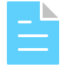

#  Simple To-do list app

A simple To-do list app for desktop to write down everyday tasks.

##  Technologies

- VisualStudio Code
- GitHub
- Python
- Nucleo
- Figma
- Tkinter

##  Features

This is what you can do with the To-do list app:

- **Add a task**: Click a "+" button, to add a task.
- **Define a task**: Describe your task or add an ending date.
- **Check as done/Remove**: After finishing your task, check it as finished or even remove it after all your tasks are done.

##  Process

I started by sketching out in Figma a simple layout of the window with the main layout of tasks manager.

As the next steps, I slowly implemented the main functions, so the desktop app would star functioning. 

I did not want the app to be as simple by implementing a check-boxes from python libraries, so I added icons from Nucleo.

In the final process, I changed the color of the background for more appealing look a better and I ensured that everything is working properly.

Along the way, I took notes on what should be improved in the future.

##  Running the app

    git clone 
    python3 todo.py

##  Improvements

- Making the app more appealing
- Implementing a database for storing tasks
- Implementing a widget form for quicker access

##  Screenshots

